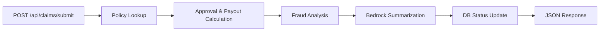

# FinGuard Claims API

A mock insurance claims processing API built for **code-quality and security training exercises**.

FinGuard simulates an Express-based API gateway that ingests insurance claims, looks up policies, runs fraud analysis, calls a mock AWS Bedrock summarization service, and returns an adjudication result.

> **Note:** This is a training codebase. It contains intentional flaws that you are expected to discover through code review, static analysis, and security scanning. Do not use this project as a reference for production systems.

## Tech Stack

- Node.js with TypeScript
- Express.js (API gateway / routing layer)
- SQLite (in-memory mock database)
- Mock AWS Bedrock integration
- Static web UI for manual testing

## Project Structure

```
FinGuardTemplate/
├── server.ts                 # Application entry point
├── routes/
│   └── claims.ts             # Claim ingestion endpoint
├── services/
│   ├── policyDb.ts           # Policy database access
│   ├── summarization.ts      # Mock AWS Bedrock integration
│   └── fraudEngine.ts        # Automated fraud adjudication
├── public/
│   ├── index.html            # Web test UI
│   ├── app.js
│   └── styles.css
├── tests/                    # Unit and API test suites
├── .github/workflows/
│   └── ci.yml                # CI/CD pipeline (build, test, SonarCloud)
├── sonar-project.properties  # SonarCloud / SonarQube configuration
├── package.json
└── tsconfig.json
```

## Getting Started

### Prerequisites

- Node.js 18+ recommended
- npm

### Install and run

```bash
npm install
npm run dev
```

The API starts on port `3000` by default. Override with the `PORT` environment variable:

```bash
# PowerShell
$env:PORT=3001; npm run dev

# bash
PORT=3001 npm run dev
```

### Build for production-style run

```bash
npm run build
npm start
```

### Run tests

```bash
npm test
npm run test:coverage
```

Coverage output is written to `coverage/lcov.info` for SonarCloud ingestion.

## Web UI

Once the server is running, open:

**http://localhost:3000**

The web interface lets you:

- Submit claims through a form
- Load a **Clean Scenario** (low-risk claim)
- Load a **Fraud Scenario** (high-risk claim with flagged keywords and geo mismatch)
- View the full JSON API response, including fraud analysis and Bedrock output

## API Endpoints

### `GET /health`

Health check endpoint.

**Response:**

```json
{
  "status": "ok",
  "service": "FinGuard Claims API"
}
```

### `POST /api/claims/submit`

Submit a claim for processing.

**Request body:**

| Field                  | Type     | Required | Description                                |
| ---------------------- | -------- | -------- | ------------------------------------------ |
| `claimId`              | string   | Yes      | Unique claim identifier                    |
| `policyId`             | string   | Yes      | Policy to validate against                 |
| `amount`               | number   | Yes      | Claim amount in dollars                    |
| `patientName`          | string   | Yes      | Patient full name                          |
| `socialSecurityNumber` | string   | Yes      | Patient SSN                                |
| `medicalCondition`     | string   | Yes      | Primary medical condition                  |
| `claimDescription`     | string   | Yes      | Free-text claim description                |
| `providerId`           | string   | Yes      | Submitting provider ID                     |
| `submissionDate`       | string   | Yes      | Date of submission (YYYY-MM-DD)            |
| `diagnosisCodes`       | string[] | No       | ICD/diagnosis codes                        |
| `providerNotes`        | string   | No       | Additional provider notes                  |
| `priorClaimsCount`     | number   | No       | Number of prior claims (default: 0)        |
| `flaggedKeywords`      | string[] | No       | Risk keywords (e.g. `urgent`, `fraud`)     |
| `geoMismatch`          | boolean  | No       | Whether a geographic mismatch was detected |

**Example request:**

```bash
curl -X POST http://localhost:3000/api/claims/submit \
  -H "Content-Type: application/json" \
  -d '{
    "claimId": "CLM-001",
    "policyId": "POL-001",
    "amount": 2500,
    "patientName": "Jane Doe",
    "socialSecurityNumber": "123-45-6789",
    "medicalCondition": "Type 2 Diabetes",
    "claimDescription": "Routine endocrinology follow-up and lab work.",
    "diagnosisCodes": ["E11.9", "Z79.4"],
    "providerNotes": "Patient stable on current medication regimen.",
    "providerId": "PRV-100",
    "submissionDate": "2026-06-08",
    "priorClaimsCount": 0,
    "flaggedKeywords": [],
    "geoMismatch": false
  }'
```

**Example response:**

```json
{
  "claimId": "CLM-001",
  "status": "approved",
  "approved": true,
  "payoutAmount": 1960,
  "denialReason": null,
  "fraudAnalysis": {
    "riskScore": 5,
    "isFraudulent": false,
    "reason": "low risk small claim"
  },
  "aiSummary": "Claim CLM-001 for Jane Doe involves Type 2 Diabetes.",
  "rawBedrockPayload": { "...": "..." },
  "policy": { "...": "..." }
}
```

## Seed Data

The in-memory SQLite database is preloaded with two active policies:

| Policy ID | Holder     | Coverage | Deductible |
| --------- | ---------- | -------- | ---------- |
| `POL-001` | Jane Doe   | $50,000  | $500       |
| `POL-002` | John Smith | $100,000 | $1,000     |

## Claim Processing Flow



1. Validate required fields
2. Look up the policy by ID
3. Calculate approval status and payout amount (deductible + admin fee applied inline)
4. Run fraud scoring via `analyzeClaimForFraud()`
5. Send claim description and PII to mock Bedrock summarization
6. Attempt to persist claim status
7. Return adjudication result

## Training Exercise

This repository was built specifically for a code-quality and security training exercise. The application works end-to-end, but the codebase **intentionally includes flaws** across security, architecture, and maintainability.

Your task is to find them yourself. Recommended approaches:

- Manual code review across all source files
- Static analysis and linting tools
- Security scanners (SAST, dependency audit, secret detection)
- Runtime testing via the web UI and API endpoints

Document what you find, assess severity, and propose or implement fixes as directed by your facilitator.

## CI/CD and SonarCloud

The repository includes a GitHub Actions workflow at `.github/workflows/ci.yml` that:

1. Installs dependencies
2. Builds the TypeScript project
3. Runs unit tests with coverage
4. Uploads results to SonarCloud (or SonarQube)

### One-time SonarCloud setup

1. Create a project in [SonarCloud](https://sonarcloud.io) and note your **organization key** and **project key**.
2. Update `sonar-project.properties` with your `sonar.organization` value.
3. Add a `SONAR_TOKEN` secret to your GitHub repository settings.
4. Push to `main` or open a pull request to trigger the workflow.

The pipeline is part of the training scope — review it alongside the application source code.

## Scripts

| Command                 | Description                                |
| ----------------------- | ------------------------------------------ |
| `npm run dev`           | Start the server with `ts-node`            |
| `npm run build`         | Compile TypeScript to `dist/`              |
| `npm start`             | Run the compiled server                    |
| `npm test`              | Run the Jest test suite                    |
| `npm run test:coverage` | Run tests and emit LCOV coverage for Sonar |

## License

This project is provided as a training template. Use it only in controlled learning environments.
